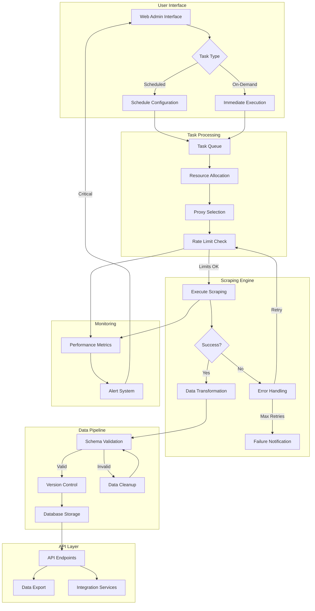
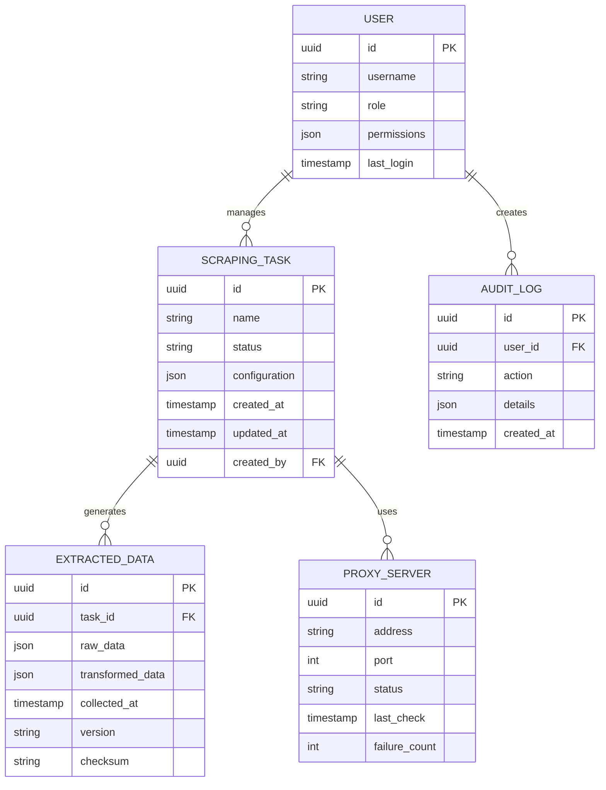
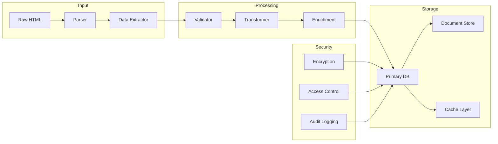
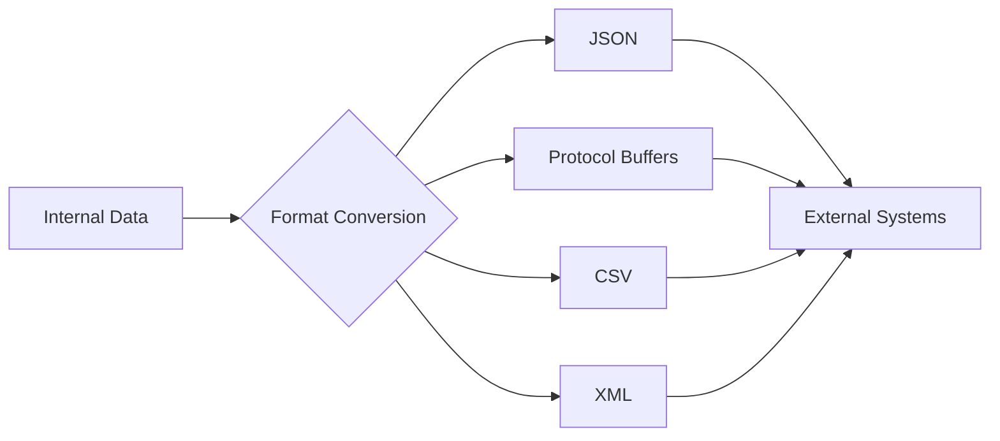

# Product Requirements Document (PRD)

# 1. INTRODUCTION

## 1.1 Purpose
This Software Requirements Specification (SRS) document provides a comprehensive description of the Web Scraping Platform implementation. It details the functional and non-functional requirements for stakeholders including:
- Development teams responsible for system implementation
- Project managers overseeing the development lifecycle
- Quality assurance teams validating system functionality
- Business stakeholders evaluating project alignment with objectives
- System administrators planning deployment and maintenance

## 1.2 Scope
The Web Scraping Platform is an enterprise-grade data collection system that enables automated extraction and standardization of web data. The system encompasses:

### 1.2.1 Core Capabilities
- Concurrent web scraping across multiple domains
- Configurable data extraction and transformation
- Scheduled and on-demand task execution
- Secure data storage and version control
- RESTful API integration endpoints

### 1.2.2 Key Benefits
- Reduced manual data collection effort
- Standardized data output formats
- Enterprise-level reliability and scalability
- Compliance-focused architecture
- Comprehensive monitoring and error handling

### 1.2.3 System Boundaries
The platform includes:
- Web-based administration interface
- Scalable scraping engine
- Data transformation pipeline
- Task scheduling system
- Storage and API layers

Excludes:
- Data analysis tools
- Visualization capabilities
- Direct database manipulation tools
- Custom reporting solutions

# 2. PRODUCT DESCRIPTION

## 2.1 Product Perspective
The Web Scraping Platform operates as a standalone enterprise system while integrating with existing data infrastructure through its API layer. The system architecture consists of:

- Frontend Layer: Web-based administration interface operating independently
- Processing Layer: Distributed scraping engine with transformation pipeline
- Storage Layer: Scalable database infrastructure for extracted data
- Integration Layer: RESTful APIs for external system connectivity

## 2.2 Product Functions
- Web Scraping Engine
  - Concurrent task execution
  - Intelligent rate limiting
  - Proxy rotation management
  - Authentication handling
  
- Data Processing Pipeline
  - Schema-based transformation
  - Data validation and cleaning
  - Version control tracking
  - Error detection and correction

- Task Management
  - Scheduled execution
  - Real-time monitoring
  - Performance analytics
  - Resource optimization

- Data Access
  - RESTful API endpoints
  - Structured data export
  - Access control management
  - Audit logging

## 2.3 User Characteristics

### System Administrators
- Technical expertise: Advanced
- Responsibilities: System configuration, security management, performance tuning
- Access level: Full system access
- Primary tools: Administration console, monitoring dashboard

### Data Engineers
- Technical expertise: Intermediate to Advanced
- Responsibilities: Scraping task configuration, data transformation rules
- Access level: Configuration and monitoring access
- Primary tools: Task configuration interface, debugging tools

### Business Analysts
- Technical expertise: Basic to Intermediate
- Responsibilities: Data extraction review, report generation
- Access level: Data access and basic task monitoring
- Primary tools: Data export interface, API access

## 2.4 Constraints
- Technical Constraints
  - Must operate within target website rate limits
  - Proxy service availability and performance
  - Network bandwidth limitations
  - Processing capacity limits

- Regulatory Constraints
  - Data privacy compliance requirements
  - Website terms of service adherence
  - Regional data protection laws
  - Industry-specific regulations

- Operational Constraints
  - 24/7 availability requirement
  - Maximum 1-hour recovery time objective
  - 99.9% uptime SLA
  - Budget limitations for infrastructure

## 2.5 Assumptions and Dependencies
### Assumptions
- Target websites maintain stable HTML structure
- Sufficient network bandwidth available
- Users have basic technical knowledge
- Standard security protocols are adequate

### Dependencies
- Cloud infrastructure availability
- Third-party proxy service reliability
- Database system performance
- Network connectivity stability
- External API service levels
- Browser rendering engine updates

# 3. PROCESS FLOWCHART

# 4. FUNCTIONAL REQUIREMENTS

## 4.1 Web Scraping Engine

| ID | Description | Priority |
|---|---|---|
| F1.1 | Concurrent execution of multiple scraping tasks with configurable thread limits | High |
| F1.2 | Intelligent rate limiting based on target website response patterns | High |
| F1.3 | Automatic proxy rotation with health checking and blacklisting | Medium |
| F1.4 | Support for multiple authentication methods (Basic, OAuth, Form-based) | High |
| F1.5 | robots.txt parsing and compliance enforcement | High |
| F1.6 | Custom header and cookie management per domain | Medium |
| F1.7 | JavaScript rendering support for dynamic content | Medium |

## 4.2 Data Processing Pipeline

| ID | Description | Priority |
|---|---|---|
| F2.1 | Schema-based data transformation with validation | High |
| F2.2 | Configurable data cleaning and normalization rules | High |
| F2.3 | Version control for extracted data with change tracking | Medium |
| F2.4 | Error detection with automatic correction suggestions | Medium |
| F2.5 | Data deduplication and merge capabilities | Medium |
| F2.6 | Custom field mapping and transformation functions | High |
| F2.7 | Data quality scoring and validation reporting | Low |

## 4.3 Task Management System

| ID | Description | Priority |
|---|---|---|
| F3.1 | Scheduled task execution with cron-style configuration | High |
| F3.2 | Real-time task monitoring and status updates | High |
| F3.3 | Performance analytics and resource usage tracking | Medium |
| F3.4 | Task prioritization and queue management | Medium |
| F3.5 | Automatic task retry with configurable attempts | High |
| F3.6 | Dependency management between tasks | Low |
| F3.7 | Task templates and bulk configuration | Medium |

## 4.4 Data Access Layer

| ID | Description | Priority |
|---|---|---|
| F4.1 | RESTful API endpoints for data retrieval and management | High |
| F4.2 | Multiple export formats (JSON, CSV, XML) | High |
| F4.3 | Role-based access control with granular permissions | High |
| F4.4 | Comprehensive audit logging of all data access | Medium |
| F4.5 | API rate limiting and usage monitoring | Medium |
| F4.6 | Bulk data export capabilities | Medium |
| F4.7 | Real-time data streaming endpoints | Low |

## 4.5 Monitoring and Alerting

| ID | Description | Priority |
|---|---|---|
| F5.1 | Real-time system health monitoring dashboard | High |
| F5.2 | Configurable alert thresholds and notifications | High |
| F5.3 | Error tracking and classification system | Medium |
| F5.4 | Performance metrics collection and analysis | Medium |
| F5.5 | Custom monitoring dashboard creation | Low |
| F5.6 | Historical performance data retention | Medium |
| F5.7 | Integration with external monitoring systems | Low |

# 5. NON-FUNCTIONAL REQUIREMENTS

## 5.1 Performance Requirements

| Requirement | Description | Target Metric |
|------------|-------------|---------------|
| Response Time | Maximum API response latency | < 200ms for 95% of requests |
| Throughput | Concurrent scraping tasks | 100+ simultaneous tasks |
| Page Processing | Page scraping rate | 1000+ pages/minute |
| Resource Usage | CPU utilization | < 80% under peak load |
| Memory Usage | RAM consumption per worker | < 512MB per scraping thread |
| Database Performance | Query response time | < 100ms for standard queries |
| Network Bandwidth | Available throughput | Minimum 1Gbps |

## 5.2 Safety Requirements

| Requirement | Description | Implementation |
|------------|-------------|----------------|
| Data Backup | Regular automated backups | Every 6 hours with 30-day retention |
| Failure Recovery | System recovery procedures | Maximum 1-hour recovery time |
| Data Integrity | Prevent data corruption | Checksums and validation |
| Circuit Breaking | Protect from cascading failures | Automatic service isolation |
| State Management | Maintain system state consistency | Distributed state tracking |
| Rollback Capability | Return to previous stable state | Version-controlled configurations |

## 5.3 Security Requirements

| Requirement | Description | Standard |
|------------|-------------|-----------|
| Authentication | Multi-factor authentication | OAuth 2.0 / OIDC |
| Authorization | Role-based access control | RBAC with least privilege |
| Data Encryption | Data at rest and in transit | AES-256 / TLS 1.3 |
| API Security | Endpoint protection | JWT tokens with rotation |
| Credential Management | Secure credential storage | HSM integration |
| Audit Logging | Security event tracking | Comprehensive audit trails |
| Vulnerability Management | Regular security scanning | Weekly automated scans |

## 5.4 Quality Requirements

### 5.4.1 Availability
- System uptime: 99.9% (excluding planned maintenance)
- Maximum planned downtime: 4 hours/month
- Redundancy: N+1 configuration for critical components

### 5.4.2 Maintainability
- Modular architecture with loose coupling
- Automated deployment processes
- Comprehensive system documentation
- Code coverage minimum 80%

### 5.4.3 Usability
- Maximum 2-hour training requirement for basic operations
- Intuitive web interface with consistent design
- Response time feedback for all user actions
- Multi-language support (English, Spanish, Mandarin)

### 5.4.4 Scalability
- Horizontal scaling up to 1000 concurrent tasks
- Auto-scaling based on load metrics
- Database partitioning support
- Load balancing across multiple regions

### 5.4.5 Reliability
- Mean Time Between Failures (MTBF): 720 hours
- Mean Time To Recovery (MTTR): < 1 hour
- Error rate: < 0.1% of total operations
- Automated failover capability

## 5.5 Compliance Requirements

| Requirement | Description | Standard/Regulation |
|------------|-------------|-------------------|
| Data Privacy | Personal data protection | GDPR, CCPA |
| Data Storage | Regional data sovereignty | Local data protection laws |
| Access Control | Identity management | ISO 27001 |
| Audit Trails | Activity logging | SOC 2 Type II |
| Web Scraping | Ethical data collection | robots.txt compliance |
| API Standards | RESTful interface design | OpenAPI 3.0 |
| Documentation | System documentation | ISO/IEC/IEEE 29148:2018 |

# 6. DATA REQUIREMENTS

## 6.1 Data Models

## 6.2 Data Storage

| Storage Type | Purpose | Implementation |
|--------------|---------|----------------|
| Primary Database | Active task data and configurations | PostgreSQL with TimescaleDB extension |
| Document Store | Raw and transformed scraped data | MongoDB with sharding |
| Cache Layer | Frequently accessed data and rate limiting | Redis Cluster |
| Object Storage | Long-term data archival | S3-compatible storage |
| Time-series DB | Performance metrics and monitoring data | InfluxDB |

### 6.2.1 Data Retention
- Active Data: 90 days in primary database
- Archived Data: 7 years in object storage
- Audit Logs: 2 years with legal hold capability
- Monitoring Data: 30 days rolling window
- Cache Data: 24 hours maximum

### 6.2.2 Redundancy and Backup
- Database Replication: Multi-region active-passive
- Backup Schedule: Hourly incrementals, daily full backups
- Backup Retention: 30 days of daily backups
- Point-in-time Recovery: 7-day window
- Geo-redundant Storage: Minimum 3 regions

## 6.3 Data Processing

### 6.3.1 Data Security Controls

| Control Type | Implementation | Purpose |
|--------------|----------------|----------|
| Encryption at Rest | AES-256 | Protect stored data |
| Encryption in Transit | TLS 1.3 | Secure data transmission |
| Field-level Encryption | Application-level | Protect sensitive fields |
| Access Control | RBAC | Manage data access |
| Data Masking | Dynamic masking | Protect PII in exports |
| Audit Trails | Comprehensive logging | Track data access |

### 6.3.2 Data Quality Controls

| Control | Description | Implementation |
|---------|-------------|----------------|
| Schema Validation | Enforce data structure | JSON Schema validation |
| Data Cleansing | Remove invalid characters | Regex patterns |
| Deduplication | Prevent duplicate records | Checksum comparison |
| Type Checking | Ensure correct data types | Strong typing |
| Relationship Validation | Verify data integrity | Foreign key constraints |
| Quality Scoring | Assess data completeness | Custom scoring algorithm |

# 7. EXTERNAL INTERFACES

## 7.1 User Interfaces

### 7.1.1 Web Administration Console

| Interface Component | Description | Requirements |
|-------------------|-------------|--------------|
| Dashboard | Main monitoring view | Responsive design, real-time updates, customizable widgets |
| Task Configuration | Scraping task setup | Form-based interface, validation feedback, template support |
| Data Explorer | Extracted data viewer | Pagination, filtering, sorting, export options |
| System Settings | Configuration management | Grouped settings, validation, change confirmation |
| Monitoring Views | Performance metrics | Interactive charts, time range selection, drill-down capability |

### 7.1.2 Design Requirements
- Responsive layout supporting 1024x768 minimum resolution
- WCAG 2.1 Level AA compliance
- Support for dark/light themes
- Consistent typography using system fonts
- Loading state indicators for all async operations

## 7.2 Hardware Interfaces

### 7.2.1 Storage Systems
- SSD storage interface for high-performance data access
- Minimum 10GB/s throughput for primary storage
- Support for RAID 10 configuration
- Hot-swappable drive capability

### 7.2.2 Network Hardware
- 10GbE network interface cards
- Support for jumbo frames
- Hardware-level packet filtering
- Network interface bonding capability

## 7.3 Software Interfaces

### 7.3.1 Database Systems

| System | Interface Type | Purpose |
|--------|---------------|----------|
| PostgreSQL | Native protocol | Primary data storage |
| MongoDB | MongoDB Wire Protocol | Document storage |
| Redis | Redis protocol | Caching and rate limiting |
| InfluxDB | HTTP API | Metrics storage |

### 7.3.2 External Services

| Service | Interface Type | Purpose |
|---------|---------------|----------|
| Proxy Services | HTTP/SOCKS5 | IP rotation |
| Cloud Storage | S3 API | Data archival |
| Authentication | OAuth 2.0 | User authentication |
| Monitoring | Prometheus | Metrics collection |

## 7.4 Communication Interfaces

### 7.4.1 Network Protocols

| Protocol | Usage | Requirements |
|----------|-------|--------------|
| HTTPS | API and web interface | TLS 1.3, certificate management |
| WebSocket | Real-time updates | Secure WebSocket (wss://) |
| gRPC | Internal services | HTTP/2, Protocol Buffers |
| MQTT | Event messaging | QoS Level 1 minimum |

### 7.4.2 Data Formats

### 7.4.3 API Specifications

| API Type | Format | Version |
|----------|--------|---------|
| REST API | OpenAPI 3.0 | v1 |
| GraphQL | Schema Definition Language | v1 |
| WebSocket | JSON Messages | v1 |
| gRPC | Protocol Buffers | v1 |

# 8. APPENDICES

## 8.1 GLOSSARY

| Term | Definition |
|------|------------|
| Circuit Breaking | Design pattern that prevents system failure by stopping operations when downstream services fail |
| Data Lineage | Documentation of data's origins, transformations, and movement through the system |
| Point-in-time Recovery | Capability to restore database to any previous state within a retention window |
| Proxy Rotation | Systematic cycling through different proxy servers to avoid IP-based rate limiting |
| Rate Limiting | Control mechanism that regulates the frequency of requests to target websites |
| robots.txt | Standard file on websites that specifies crawling permissions and restrictions |
| Schema Validation | Process of verifying that data conforms to a predefined structure |
| Web Scraping | Automated extraction of data from websites using programmatic methods |

## 8.2 ACRONYMS

| Acronym | Full Form |
|---------|-----------|
| API | Application Programming Interface |
| CCPA | California Consumer Privacy Act |
| GDPR | General Data Protection Regulation |
| HSM | Hardware Security Module |
| MTBF | Mean Time Between Failures |
| MTTR | Mean Time To Recovery |
| OIDC | OpenID Connect |
| PII | Personally Identifiable Information |
| RBAC | Role-Based Access Control |
| REST | Representational State Transfer |
| SLA | Service Level Agreement |
| SOC | System and Organization Controls |
| TLS | Transport Layer Security |
| WCAG | Web Content Accessibility Guidelines |

## 8.3 ADDITIONAL REFERENCES

| Reference | Description | URL |
|-----------|-------------|-----|
| OpenAPI Specification | REST API documentation standard | https://www.openapis.org |
| OWASP Web Security | Security best practices | https://owasp.org/www-project-web-security-testing-guide |
| Protocol Buffers | Data serialization format | https://developers.google.com/protocol-buffers |
| Redis Documentation | Caching implementation | https://redis.io/documentation |
| TimescaleDB | Time-series database extension | https://docs.timescale.com |
| Web Scraping Legal Guide | Legal considerations for web scraping | https://www.zyte.com/learn/web-scraping-legal-guide |