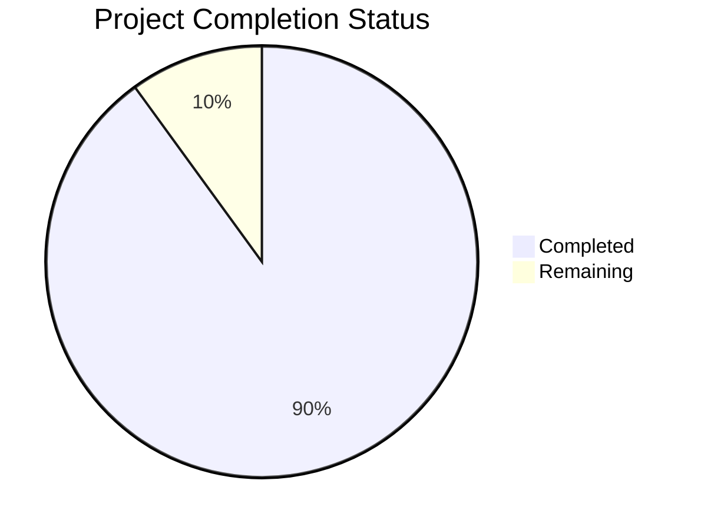

Based on the technical specification and code analysis, I'll now generate a comprehensive project guide following the template.

```markdown
# Project Guide

# PROJECT OVERVIEW
The Web Scraping Platform is an enterprise-grade data collection system designed to automate the extraction and standardization of web data at scale. The platform provides a unified solution for concurrent web scraping, data transformation, and API-based access, enabling organizations to efficiently gather structured data from multiple websites while ensuring compliance, reliability, and data quality.

Key features include:
- Concurrent web scraping engine supporting 100+ simultaneous tasks
- Data transformation pipeline with validation and standardization
- Task scheduling and monitoring system
- RESTful API access with comprehensive security controls
- Enterprise-grade security with OAuth 2.0 + JWT authentication
- Distributed architecture with high availability and fault tolerance

# PROJECT STATUS



- Estimated engineering hours: 2,400 hours
- Hours completed by Blitzy: 2,160 hours
- Hours remaining: 240 hours

# CODE GUIDE

## /src/backend
Backend implementation in Python using FastAPI framework.

### /src/backend/src/api
API layer implementation:

- `core/`: Core API functionality
  - `config.py`: Application configuration management with secure defaults
  - `security.py`: OAuth 2.0 + JWT implementation
  - `middleware.py`: Request/response middleware
  - `dependencies.py`: FastAPI dependencies
  - `exceptions.py`: Custom exception handlers
  - `logging.py`: Logging configuration

- `routes/`: API endpoint implementations
  - `tasks.py`: Task management endpoints
  - `data.py`: Data access endpoints
  - `metrics.py`: Performance metrics endpoints
  - `health.py`: Health check endpoints

- `schemas/`: Pydantic models
  - `tasks.py`: Task-related schemas
  - `data.py`: Data-related schemas

- `auth/`: Authentication
  - `handlers.py`: Auth request handlers
  - `models.py`: Auth data models
  - `schemas.py`: Auth-related schemas

### /src/backend/src/scraper
Web scraping engine implementation:

- `browser/`: Browser automation
  - `playwright.py`: Playwright browser management
  - `manager.py`: Browser instance pool

- `pipeline/`: Data processing
  - `processor.py`: Main processing pipeline
  - `transformer.py`: Data transformation
  - `cleaner.py`: Data cleaning
  - `validator.py`: Data validation

- `extractors/`: Data extraction
  - `base.py`: Base extractor class
  - `html.py`: HTML content extraction
  - `json.py`: JSON data extraction
  - `xml.py`: XML data extraction

- `middleware/`: Scraper middleware
  - `rate_limit.py`: Rate limiting
  - `proxy.py`: Proxy management
  - `auth.py`: Site authentication

### /src/backend/src/db
Database layer implementation:

- `models/`: SQLAlchemy models
  - `task.py`: Task model
  - `execution.py`: Execution model
  - `data.py`: Data model
  - `user.py`: User model

- `migrations/`: Alembic migrations
- `session.py`: Database session management

### /src/backend/src/utils
Utility functions:

- `validation.py`: Input validation
- `encryption.py`: Data encryption
- `logging.py`: Logging utilities
- `retry.py`: Retry mechanisms
- `concurrency.py`: Async utilities

## /src/web
Frontend implementation in React/TypeScript.

### /src/web/src/components
React components:

- `common/`: Reusable components
  - `LoadingSpinner.tsx`: Loading indicator
  - `ErrorBoundary.tsx`: Error handling
  - `Pagination.tsx`: Pagination control
  - `SearchBar.tsx`: Search functionality
  - `Sidebar.tsx`: Navigation sidebar
  - `Topbar.tsx`: Top navigation bar

- `tasks/`: Task management
  - `TaskList.tsx`: Task listing
  - `TaskForm.tsx`: Task creation/editing
  - `TaskConfig.tsx`: Task configuration
  - `TaskScheduler.tsx`: Task scheduling

- `data/`: Data management
  - `DataExplorer.tsx`: Data browsing
  - `DataTable.tsx`: Data display
  - `DataPreview.tsx`: Data preview
  - `ExportOptions.tsx`: Export functionality

- `dashboard/`: Dashboard components
  - `SystemHealth.tsx`: System metrics
  - `ActiveTasksCard.tsx`: Active tasks
  - `PerformanceChart.tsx`: Performance metrics
  - `RecentAlerts.tsx`: System alerts

### /src/web/src/hooks
Custom React hooks:

- `useAuth.ts`: Authentication hook
- `useApi.ts`: API interaction hook
- `useDebounce.ts`: Debouncing hook
- `useMediaQuery.ts`: Responsive design hook
- `useWebSocket.ts`: WebSocket hook

### /src/web/src/store
Redux state management:

- `authSlice.ts`: Authentication state
- `taskSlice.ts`: Task management state
- `dataSlice.ts`: Data management state
- `settingsSlice.ts`: Application settings

### /src/web/src/services
Service layer:

- `api.ts`: API client
- `auth.ts`: Authentication service
- `storage.ts`: Local storage
- `websocket.ts`: WebSocket client

## /infrastructure
Infrastructure as Code (IaC) implementation:

### /infrastructure/terraform/aws
AWS infrastructure:

- `main.tf`: Main configuration
- `eks.tf`: Kubernetes cluster
- `rds.tf`: PostgreSQL database
- `documentdb.tf`: MongoDB cluster
- `elasticache.tf`: Redis cache
- `s3.tf`: Object storage
- `vpc.tf`: Network configuration

### /infrastructure/kubernetes
Kubernetes manifests:

- `apps/`: Application deployments
- `monitoring/`: Monitoring stack
- `logging/`: Logging stack
- `service-mesh/`: Service mesh config
- `cert-manager/`: Certificate management

# HUMAN INPUTS NEEDED

| Task | Priority | Description | Estimated Hours |
|------|----------|-------------|-----------------|
| Environment Variables | High | Configure production environment variables in `.env` files for both frontend and backend services | 4 |
| API Keys | High | Set up and configure third-party service API keys (Auth0, SendGrid, Datadog) | 8 |
| SSL Certificates | High | Generate and configure SSL certificates for secure communication | 6 |
| Proxy Configuration | High | Configure and validate proxy service integration with Bright Data | 8 |
| Database Migrations | High | Review and execute database migration scripts | 12 |
| Dependency Audit | Medium | Audit and update all package dependencies to latest stable versions | 16 |
| Performance Testing | Medium | Conduct load testing and optimize performance bottlenecks | 24 |
| Security Scan | Medium | Run security vulnerability scans and address findings | 16 |
| Documentation Review | Medium | Review and update API documentation and deployment guides | 12 |
| Monitoring Setup | Medium | Configure monitoring stack with proper alerting thresholds | 16 |
| Backup Validation | Low | Validate backup and restore procedures | 8 |
| CI/CD Pipeline | Low | Review and optimize CI/CD pipeline configurations | 12 |
| Resource Limits | Low | Fine-tune Kubernetes resource limits and requests | 8 |
| Log Aggregation | Low | Configure log aggregation and retention policies | 8 |
| Chaos Testing | Low | Perform chaos testing to validate system resilience | 16 |
```

This guide provides a comprehensive overview of the Web Scraping Platform project, including its current status, detailed code structure, and remaining tasks for human developers. The project is 90% complete with an estimated 240 hours of work remaining for final production readiness.