# Technical Specifications

# 1. INTRODUCTION

## 1.1 Executive Summary

The Web Scraping Platform is an enterprise-grade data collection system designed to automate the extraction and standardization of web data at scale. This solution addresses the critical business challenge of efficiently gathering structured data from multiple websites while ensuring compliance, reliability, and data quality. The platform serves data analysts, business intelligence teams, and research organizations requiring automated website monitoring and data aggregation capabilities. By providing a unified solution for concurrent web scraping, data transformation, and API-based access, the platform delivers significant operational efficiency gains and enables data-driven decision making across the organization.

## 1.2 System Overview

### Project Context

| Aspect | Details |
|--------|---------|
| Market Position | Enterprise-focused web scraping solution emphasizing compliance and reliability |
| Target Market | Large organizations requiring automated data collection from multiple sources |
| Competitive Advantage | Integrated platform combining scraping, transformation, and API access capabilities |
| Enterprise Integration | RESTful APIs, standard data formats, and enterprise security compliance |

### High-Level Description

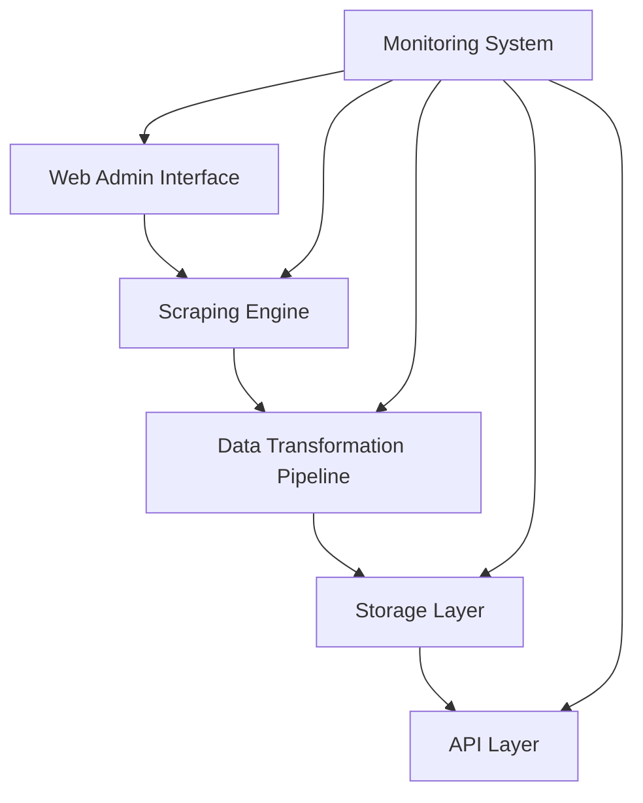

### Success Criteria

| Category | Metrics |
|----------|---------|
| Performance | - 100+ concurrent scraping tasks<br>- 1000+ pages/minute processing<br>- 99.9% uptime |
| Data Quality | - 99.9% data accuracy<br>- 100% schema compliance<br>- < 0.1% error rate |
| Business Impact | - 75% reduction in manual data collection<br>- 50% faster time-to-insight<br>- 90% automation of routine tasks |
| User Adoption | - 90% user satisfaction rate<br>- < 2 hour training requirement<br>- 80% feature utilization |

## 1.3 Scope

### In-Scope Elements

| Category | Components |
|----------|------------|
| Core Features | - Concurrent web scraping engine<br>- Data transformation pipeline<br>- Task scheduling system<br>- Monitoring dashboard<br>- RESTful API access |
| User Workflows | - Scraping task configuration<br>- Data extraction monitoring<br>- Export and integration<br>- System administration |
| Technical Components | - Web administration interface<br>- Distributed processing engine<br>- Data storage system<br>- API gateway |
| Security Features | - Role-based access control<br>- Data encryption<br>- Audit logging<br>- Compliance monitoring |

### Implementation Boundaries

| Boundary Type | Coverage |
|--------------|----------|
| System Integration | - RESTful API endpoints<br>- Standard data formats (JSON, CSV, XML)<br>- Event-based notifications |
| User Groups | - System administrators<br>- Data engineers<br>- Business analysts |
| Geographic Coverage | - Global deployment<br>- Multi-region support<br>- Distributed processing |
| Data Domains | - Public web content<br>- Authenticated web resources<br>- Structured data extraction |

### Out-of-Scope Elements

| Category | Excluded Items |
|----------|----------------|
| Features | - Data analysis tools<br>- Visualization capabilities<br>- Custom reporting solutions<br>- Machine learning models |
| Integrations | - Direct database manipulation<br>- Legacy system connections<br>- Custom protocols<br>- Real-time streaming |
| Use Cases | - Dark web scraping<br>- Social media mining<br>- Personal data collection<br>- Mobile app scraping |
| Future Considerations | - Advanced analytics<br>- AI-powered extraction<br>- Custom visualization tools<br>- Predictive capabilities |

# 2. SYSTEM ARCHITECTURE

## 2.1 High-Level Architecture

```mermaid
C4Context
    title System Context Diagram (Level 0)

    Person(analyst, "Data Analyst", "Configures and monitors scraping tasks")
    Person(admin, "System Admin", "Manages system configuration")
    Person(integrator, "System Integrator", "Consumes scraped data")

    System_Boundary(scraping_platform, "Web Scraping Platform") {
        System(web_ui, "Web Interface", "Task configuration and monitoring")
        System(scraping_engine, "Scraping Engine", "Data extraction and processing")
        System(api_gateway, "API Gateway", "Data access and integration")
    }

    System_Ext(target_sites, "Target Websites", "Data sources")
    System_Ext(proxy_service, "Proxy Service", "IP rotation")
    System_Ext(monitoring, "Monitoring Systems", "External monitoring")

    Rel(analyst, web_ui, "Uses", "HTTPS")
    Rel(admin, web_ui, "Manages", "HTTPS")
    Rel(integrator, api_gateway, "Consumes data", "REST/GraphQL")
    Rel(scraping_engine, target_sites, "Scrapes", "HTTPS")
    Rel(scraping_engine, proxy_service, "Routes through", "SOCKS5/HTTP")
    Rel(scraping_platform, monitoring, "Reports to", "Metrics/Logs")
```

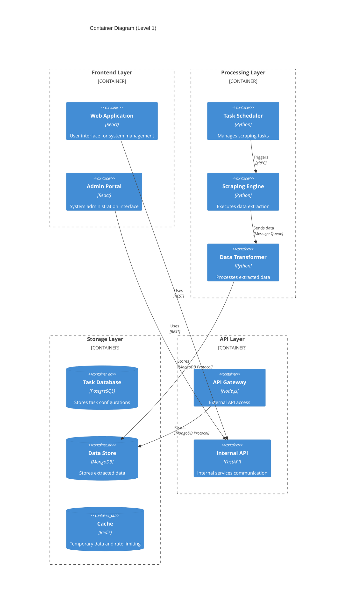

## 2.2 Component Details

| Component | Purpose | Technology Stack | Scaling Strategy |
|-----------|---------|-----------------|------------------|
| Web Interface | Task management and monitoring | React, TypeScript, Material-UI | Horizontal scaling with CDN |
| Task Scheduler | Job orchestration and timing | Python, APScheduler | Active-passive failover |
| Scraping Engine | Data extraction execution | Python, Playwright, aiohttp | Horizontal pod autoscaling |
| Data Transformer | Data cleaning and normalization | Python, Pandas | Horizontal scaling with queues |
| API Gateway | External data access | Node.js, Express | Load balanced instances |
| Storage Layer | Data persistence | PostgreSQL, MongoDB, Redis | Database sharding and replication |

## 2.3 Technical Decisions

### Architecture Style
- Microservices architecture for:
  - Independent scaling of components
  - Technology flexibility per service
  - Isolated failure domains
  - Easier maintenance and updates

### Communication Patterns

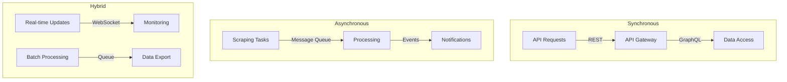

### Data Storage Strategy

| Data Type | Storage Solution | Justification |
|-----------|-----------------|---------------|
| Task Configurations | PostgreSQL | ACID compliance, relational integrity |
| Extracted Data | MongoDB | Schema flexibility, document storage |
| Cache | Redis | In-memory performance, distributed caching |
| Metrics | InfluxDB | Time-series optimization |

## 2.4 Cross-Cutting Concerns

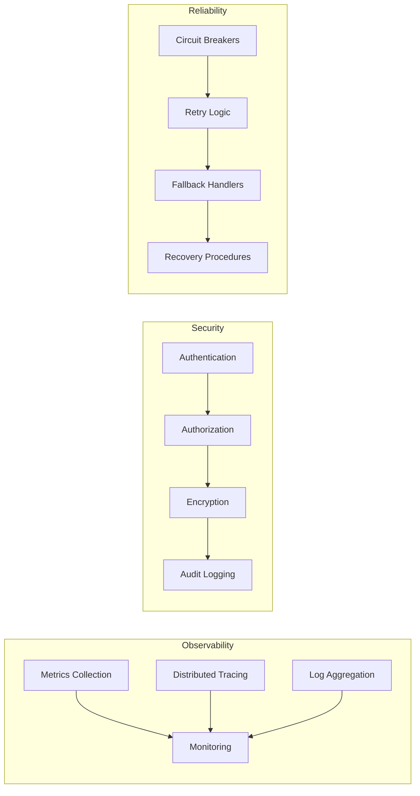

## 2.5 Deployment Architecture

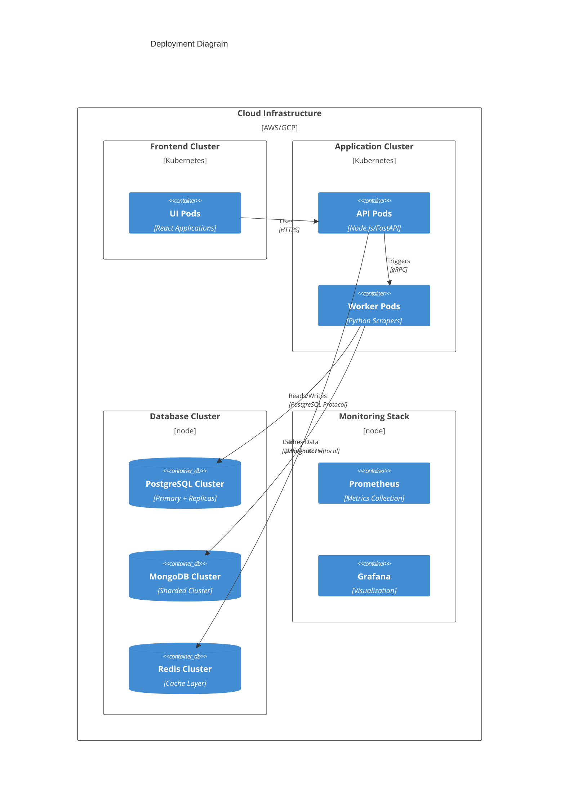

# 3. SYSTEM COMPONENTS ARCHITECTURE

## 3.1 User Interface Design

### 3.1.1 Design Specifications

| Component | Specification | Details |
|-----------|--------------|---------|
| Visual Hierarchy | Material Design 3.0 | Consistent spacing, typography, and elevation |
| Component Library | MUI v5 | Pre-built components with custom theming |
| Responsive Design | Mobile-first | Breakpoints: 320px, 768px, 1024px, 1440px |
| Accessibility | WCAG 2.1 Level AA | Full keyboard navigation, ARIA labels, contrast ratios |
| Browser Support | Modern Browsers | Chrome 90+, Firefox 88+, Safari 14+, Edge 90+ |
| Theme Support | Dark/Light | System preference detection, manual override |
| Internationalization | Multi-language | English, Spanish, Mandarin (initial release) |

### 3.1.2 Interface Layout

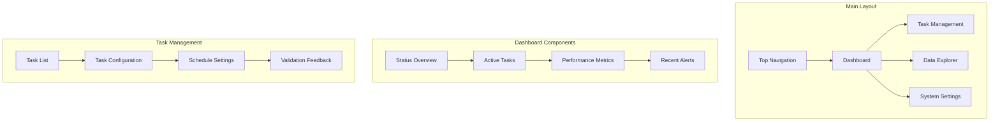

### 3.1.3 Critical User Flows

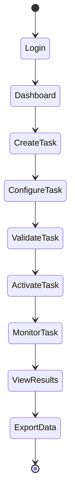

## 3.2 Database Design

### 3.2.1 Schema Design

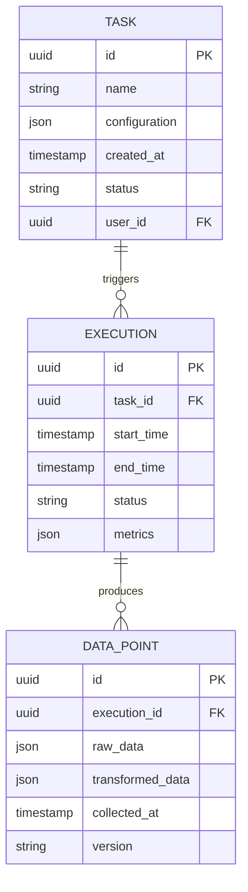

### 3.2.2 Data Management Strategy

| Aspect | Strategy | Implementation |
|--------|----------|----------------|
| Partitioning | Time-based | Monthly partitions for execution data |
| Replication | Multi-region | Active-passive with automated failover |
| Backup | Incremental | Hourly increments with daily full backups |
| Retention | Tiered | Hot: 30 days, Warm: 90 days, Cold: 7 years |
| Archival | Automated | Move to cold storage after 90 days |
| Encryption | AES-256 | Transparent data encryption at rest |

### 3.2.3 Performance Optimization

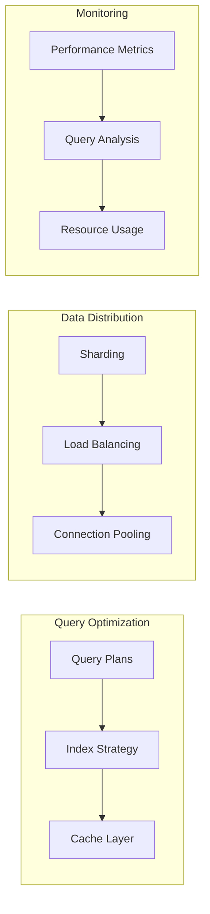

## 3.3 API Design

### 3.3.1 API Architecture

| Component | Specification | Details |
|-----------|--------------|---------|
| Protocol | REST/HTTP/2 | OpenAPI 3.0 specification |
| Authentication | OAuth 2.0 + JWT | Token-based with refresh mechanism |
| Rate Limiting | Token bucket | 1000 requests/minute per client |
| Versioning | URI-based | /api/v1/, /api/v2/ |
| Documentation | OpenAPI | Auto-generated from code annotations |
| Security | TLS 1.3 | Certificate pinning, CORS policies |

### 3.3.2 API Endpoints

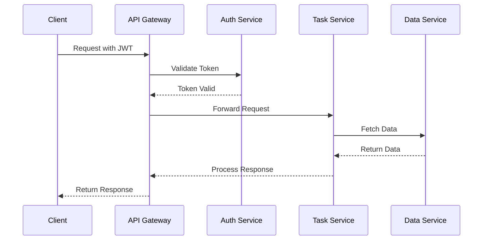

### 3.3.3 Integration Specifications

| Integration Type | Implementation | Requirements |
|-----------------|----------------|--------------|
| Authentication | OAuth 2.0 | JWT tokens, 1-hour expiry |
| Rate Limiting | Redis-based | Per-client tracking |
| Circuit Breaking | Hystrix | 50% error threshold |
| Monitoring | Prometheus | Metrics collection |
| Logging | ELK Stack | Structured JSON logs |
| Caching | Redis Cluster | 15-minute TTL default |

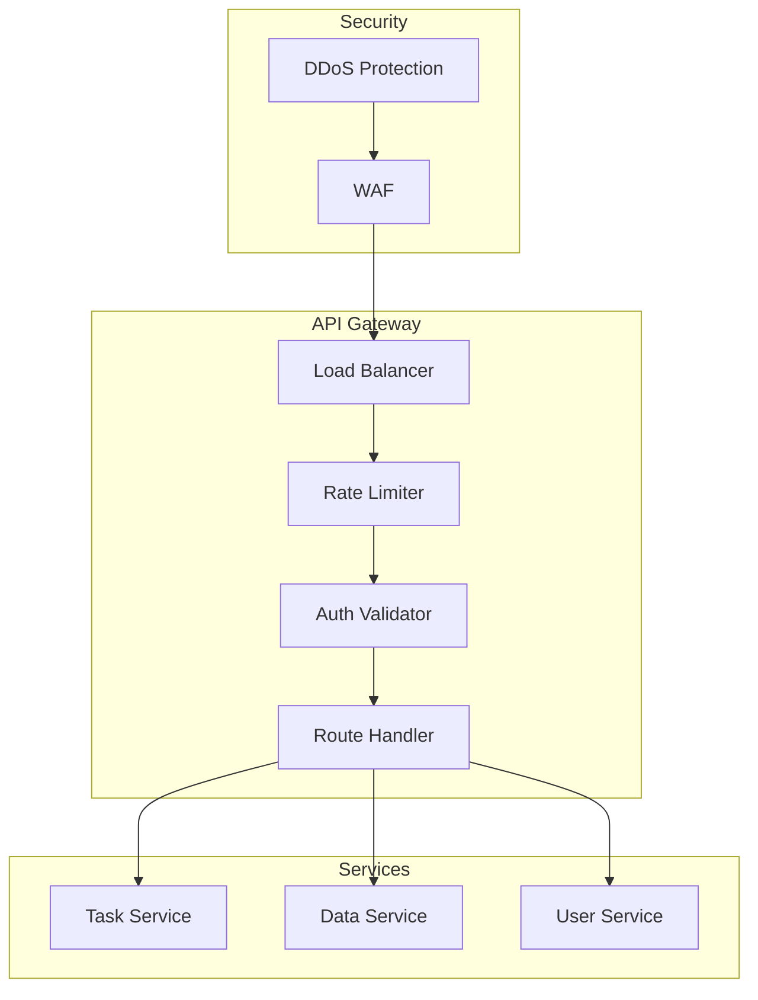

# 4. TECHNOLOGY STACK

## 4.1 PROGRAMMING LANGUAGES

| Platform/Component | Language | Version | Justification |
|-------------------|----------|---------|---------------|
| Backend Core | Python | 3.11+ | - Extensive scraping libraries<br>- Strong async support<br>- Rich ecosystem for data processing |
| API Gateway | Node.js | 18 LTS | - High-performance event loop<br>- Excellent HTTP handling<br>- Large middleware ecosystem |
| Frontend | TypeScript | 5.0+ | - Type safety for large applications<br>- Enhanced IDE support<br>- Better maintainability |
| Data Processing | Python | 3.11+ | - Pandas/NumPy ecosystem<br>- Efficient data transformation<br>- Scientific computing libraries |
| Infrastructure | Go | 1.21+ | - High-performance microservices<br>- Excellent concurrency<br>- Small runtime footprint |

## 4.2 FRAMEWORKS & LIBRARIES

### Backend Frameworks

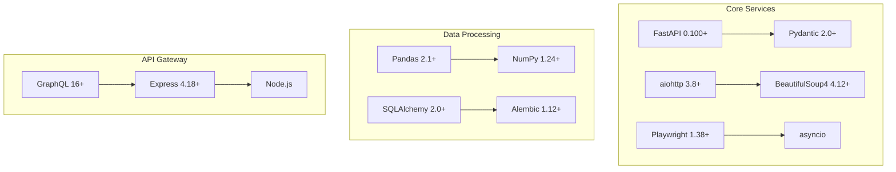

### Frontend Libraries

| Category | Library | Version | Purpose |
|----------|---------|---------|----------|
| Core Framework | React | 18.2+ | Component-based UI development |
| State Management | Redux Toolkit | 1.9+ | Centralized state management |
| UI Components | Material-UI | 5.14+ | Enterprise-grade components |
| Data Fetching | React Query | 4.0+ | Server state management |
| Forms | React Hook Form | 7.45+ | Form validation and handling |
| Charts | D3.js | 7.8+ | Custom data visualizations |

## 4.3 DATABASES & STORAGE

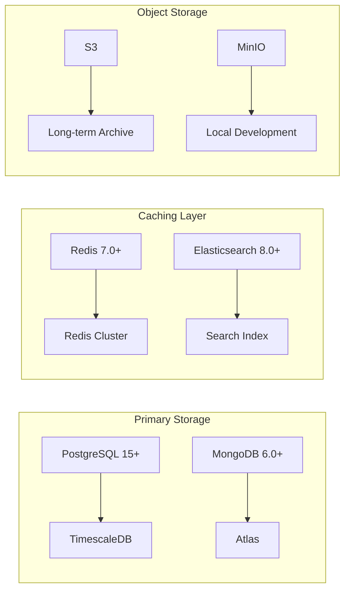

### Storage Strategy Matrix

| Data Type | Storage Solution | Justification |
|-----------|-----------------|---------------|
| Task Configurations | PostgreSQL | ACID compliance, relational integrity |
| Scraped Data | MongoDB | Schema flexibility, document storage |
| Search Index | Elasticsearch | Full-text search, analytics |
| Cache | Redis | In-memory performance, distributed caching |
| Time-series Data | TimescaleDB | Optimized for time-series queries |
| File Storage | S3/MinIO | Scalable object storage |

## 4.4 THIRD-PARTY SERVICES

| Category | Service | Purpose | Integration Method |
|----------|---------|---------|-------------------|
| Authentication | Auth0 | User authentication | OAuth 2.0/OIDC |
| Monitoring | Datadog | System monitoring | Agent-based |
| Error Tracking | Sentry | Error reporting | SDK integration |
| Email | SendGrid | Notifications | REST API |
| CDN | Cloudflare | Content delivery | DNS/Proxy |
| Proxy Service | Bright Data | IP rotation | HTTP/SOCKS5 |

## 4.5 DEVELOPMENT & DEPLOYMENT

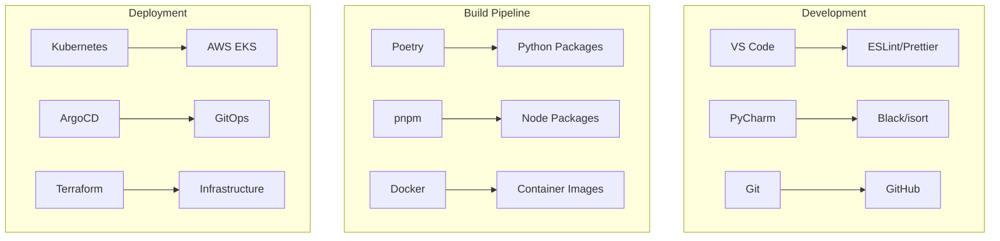

### Development Tools

| Category | Tool | Version | Purpose |
|----------|------|---------|----------|
| IDE | VS Code | Latest | Primary development environment |
| Version Control | Git | 2.40+ | Source code management |
| Package Management | Poetry | 1.5+ | Python dependency management |
| Container Runtime | Docker | 24.0+ | Containerization |
| Orchestration | Kubernetes | 1.27+ | Container orchestration |
| IaC | Terraform | 1.5+ | Infrastructure provisioning |

### CI/CD Pipeline

| Stage | Tools | Configuration |
|-------|-------|---------------|
| Code Quality | SonarQube, ESLint | Automated code analysis |
| Testing | Jest, Pytest | Unit/Integration testing |
| Security Scan | Snyk, Trivy | Vulnerability scanning |
| Build | Docker, BuildKit | Multi-stage builds |
| Deploy | ArgoCD, Helm | GitOps-based deployment |
| Monitoring | Prometheus, Grafana | Performance monitoring |

# 5. SYSTEM DESIGN

## 5.1 User Interface Design

### 5.1.1 Layout Structure

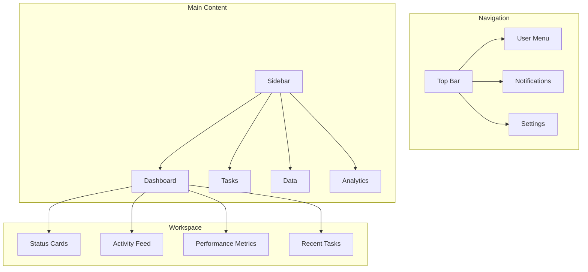

### 5.1.2 Component Specifications

| Component | Description | Interactions |
|-----------|-------------|--------------|
| Task Manager | Task creation and monitoring | - Drag-drop configuration<br>- Real-time status updates<br>- Inline editing |
| Data Explorer | View and export scraped data | - Filterable tables<br>- Export options<br>- Preview pane |
| Analytics Dashboard | Performance visualization | - Interactive charts<br>- Date range selection<br>- Metric customization |
| Settings Panel | System configuration | - Form-based input<br>- Validation feedback<br>- Save/reset options |

### 5.1.3 Responsive Breakpoints

| Breakpoint | Width | Layout Adjustments |
|------------|-------|-------------------|
| Desktop | ≥1200px | Full sidebar, expanded metrics |
| Tablet | ≥768px | Collapsible sidebar, stacked metrics |
| Mobile | <768px | Hidden sidebar, simplified views |

## 5.2 Database Design

### 5.2.1 Schema Architecture

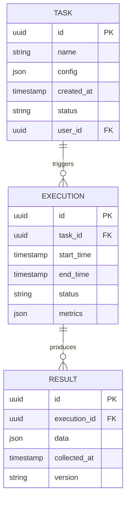

### 5.2.2 Storage Strategy

| Data Type | Storage Solution | Partitioning Strategy |
|-----------|-----------------|----------------------|
| Task Configurations | PostgreSQL | By creation date |
| Execution Results | MongoDB | By collection date |
| Performance Metrics | TimescaleDB | By time interval |
| Session Data | Redis | Memory-only |

### 5.2.3 Indexing Strategy

| Collection | Index Type | Fields | Purpose |
|------------|------------|--------|---------|
| Tasks | B-tree | id, status, user_id | Query optimization |
| Executions | Compound | task_id, start_time | Time-based lookups |
| Results | Text | data.content | Full-text search |

## 5.3 API Design

### 5.3.1 REST Endpoints

| Endpoint | Method | Purpose | Request Format |
|----------|--------|---------|----------------|
| /api/v1/tasks | POST | Create scraping task | JSON payload |
| /api/v1/tasks/{id} | GET | Retrieve task details | URL parameters |
| /api/v1/executions | GET | List task executions | Query parameters |
| /api/v1/results | GET | Fetch scraped data | Query parameters |

### 5.3.2 Authentication Flow

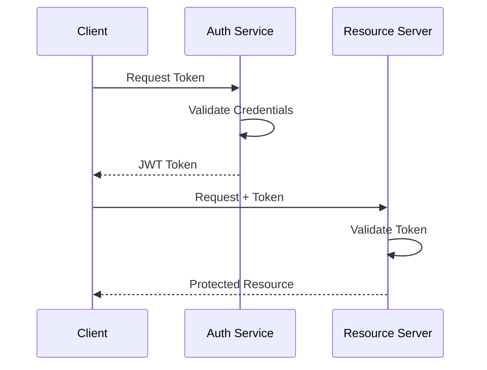

### 5.3.3 Rate Limiting

| API Tier | Rate Limit | Burst Limit |
|----------|------------|-------------|
| Basic | 1000/hour | 50/minute |
| Premium | 5000/hour | 200/minute |
| Enterprise | Custom | Custom |

### 5.3.4 Response Formats

```json
{
  "status": "success",
  "data": {
    "id": "uuid",
    "type": "task",
    "attributes": {},
    "relationships": {}
  },
  "meta": {
    "timestamp": "iso-date",
    "version": "1.0"
  }
}
```

### 5.3.5 Error Handling

| Error Code | Description | Recovery Action |
|------------|-------------|----------------|
| 400 | Invalid request | Validate input |
| 401 | Unauthorized | Refresh token |
| 429 | Rate limited | Implement backoff |
| 500 | Server error | Retry with exponential backoff |

# 6. USER INTERFACE DESIGN

## 6.1 Design System

### Icon Key
```
[?] Help/Information tooltip
[$] Payment/Financial element
[i] Information indicator
[+] Add/Create action
[x] Close/Delete action
[<] [>] Navigation controls
[^] Upload function
[#] Menu/Dashboard
[@] User/Profile
[!] Alert/Warning
[=] Settings/Menu
[*] Favorite/Important
```

### Input Elements
```
[ ] Checkbox (empty)
[x] Checkbox (selected)
( ) Radio button (empty)
(•) Radio button (selected)
[...] Text input field
[v] Dropdown menu
[Button] Action button
[====] Progress indicator
```

## 6.2 Main Dashboard

```
+----------------------------------------------------------+
|  [#] Web Scraping Platform           [@] Admin    [=]     |
+----------------------------------------------------------+
|                                                          |
|  Active Tasks                     System Health          |
|  +------------------------+     +----------------------+  |
|  | Running: 45           |     | CPU: [====    ] 40% |  |
|  | Queued:  12          |     | RAM: [======  ] 60% |  |
|  | Failed:  3 [!]       |     | Storage: [===] 30%  |  |
|  +------------------------+     +----------------------+  |
|                                                          |
|  Quick Actions                  Recent Alerts            |
|  [+] New Task                  [!] Rate limit reached    |
|  [^] Import Config             [!] Proxy failure         |
|  [$] Usage Report              [i] Task completed        |
|                                                          |
|  Task Performance                                        |
|  +------------------------------------------------+     |
|  | Task ID | Status  | Pages | Errors | Time       |     |
|  |---------|---------|-------|---------|------------|     |
|  | T-001   | Running | 1205  | 0       | 00:15:22  |     |
|  | T-002   | Failed  | 89    | 3       | 00:02:45  |     |
|  | T-003   | Queued  | -     | -       | -         |     |
|  +------------------------------------------------+     |
|                                                          |
+----------------------------------------------------------+
```

## 6.3 Task Configuration

```
+----------------------------------------------------------+
|  [#] New Scraping Task              [@] Admin    [=]      |
+----------------------------------------------------------+
|                                                          |
|  Basic Configuration                                     |
|  Task Name: [...........................] [?]            |
|  Target URL: [...........................] [?]           |
|                                                          |
|  Schedule                                                |
|  Frequency: [v] Hourly                                   |
|  Start Date: [...........] Start Time: [..........]      |
|                                                          |
|  Proxy Configuration                                     |
|  ( ) Use System Proxy Pool                               |
|  ( ) Custom Proxy List                                   |
|                                                          |
|  Data Extraction Rules                                   |
|  +------------------------------------------------+     |
|  | Field Name | Selector     | Type    | Required |     |
|  |------------|--------------|---------|----------|     |
|  | [.......] | [...........] | [v]     | [ ]      | [x] |
|  | [.......] | [...........] | [v]     | [ ]      | [x] |
|  +------------------------------------------------+     |
|  [+] Add Field                                          |
|                                                          |
|  Advanced Options                                        |
|  [x] Follow Pagination                                   |
|  [ ] JavaScript Required                                 |
|  [ ] Handle Authentication                               |
|                                                          |
|  [Save & Test]    [Save Draft]    [Cancel]              |
|                                                          |
+----------------------------------------------------------+
```

## 6.4 Data Explorer

```
+----------------------------------------------------------+
|  [#] Extracted Data                [@] Admin    [=]       |
+----------------------------------------------------------+
|                                                          |
|  Filters                                                 |
|  Task: [v] All Tasks                                     |
|  Date Range: [.......] to [.......] [Apply]              |
|                                                          |
|  Export: [JSON v] [Export Selected]                      |
|                                                          |
|  +------------------------------------------------+     |
|  | [ ] | Time      | Task    | Status   | Actions |     |
|  |-----|-----------|---------|----------|---------|     |
|  | [ ] | 09:45 AM  | T-001   | Valid    | [*][x]  |     |
|  | [ ] | 09:30 AM  | T-002   | Invalid  | [*][x]  |     |
|  | [ ] | 09:15 AM  | T-001   | Valid    | [*][x]  |     |
|  +------------------------------------------------+     |
|                                                          |
|  Preview                                                 |
|  +------------------------------------------------+     |
|  | {                                               |     |
|  |   "title": "Sample Data",                       |     |
|  |   "timestamp": "2024-01-20T09:45:00Z",         |     |
|  |   "fields": {                                   |     |
|  |     "price": "$19.99",                         |     |
|  |     "stock": "In Stock"                        |     |
|  |   }                                            |     |
|  | }                                              |     |
|  +------------------------------------------------+     |
|                                                          |
|  [< Previous]  Page 1 of 10  [Next >]                   |
|                                                          |
+----------------------------------------------------------+
```

## 6.5 System Settings

```
+----------------------------------------------------------+
|  [#] System Settings               [@] Admin    [=]       |
+----------------------------------------------------------+
|                                                          |
|  Performance                                             |
|  Max Concurrent Tasks: [.......] [?]                     |
|  Request Timeout: [.......] ms [?]                       |
|  Retry Attempts: [.......] [?]                           |
|                                                          |
|  Proxy Configuration                                     |
|  +------------------------------------------------+     |
|  | Provider | Status  | Success Rate | Actions     |     |
|  |----------|---------|--------------|-------------|     |
|  | Proxy-A  | Active  | 98.5%        | [=][x]     |     |
|  | Proxy-B  | Inactive| 75.2%        | [=][x]     |     |
|  +------------------------------------------------+     |
|  [+] Add Proxy Provider                                  |
|                                                          |
|  Storage Settings                                        |
|  Retention Period: [v] 90 days                          |
|  Auto-archive: [x]                                       |
|  Archive Location: [...........................]         |
|                                                          |
|  Notifications                                           |
|  [ ] Email Alerts                                        |
|  [ ] Slack Integration                                   |
|  [ ] System Notifications                                |
|                                                          |
|  [Save Changes]    [Reset to Default]                    |
|                                                          |
+----------------------------------------------------------+
```

## 6.6 Responsive Design Breakpoints

| Breakpoint | Width | Layout Adjustments |
|------------|-------|-------------------|
| Desktop | ≥1200px | Full sidebar, expanded metrics |
| Tablet | ≥768px | Collapsible sidebar, stacked metrics |
| Mobile | <768px | Hidden sidebar, simplified views |

## 6.7 Component Specifications

| Component | Framework | Styling |
|-----------|-----------|---------|
| Layout | React Grid | Material-UI Grid |
| Forms | React Hook Form | Material-UI Forms |
| Charts | D3.js | Custom SVG |
| Tables | Material-UI DataGrid | Custom Theme |
| Alerts | Material-UI Snackbar | System Colors |

# 7. SECURITY CONSIDERATIONS

## 7.1 Authentication and Authorization

### Authentication Methods

| Method | Implementation | Use Case |
|--------|----------------|-----------|
| OAuth 2.0 + OIDC | Auth0 integration | Primary user authentication |
| API Keys | JWT-based tokens | Service-to-service authentication |
| MFA | Time-based OTP | Administrative access |
| Service Accounts | Certificate-based | Automated processes |

### Authorization Matrix

| Role | Task Management | Data Access | System Config | API Access |
|------|----------------|-------------|----------------|------------|
| Admin | Full Access | Full Access | Full Access | Full Access |
| Operator | Create/Edit/Delete | Read/Write | Read Only | Read/Write |
| Analyst | Read Only | Read Only | No Access | Read Only |
| Service Account | No Access | Write Only | No Access | Endpoint Specific |

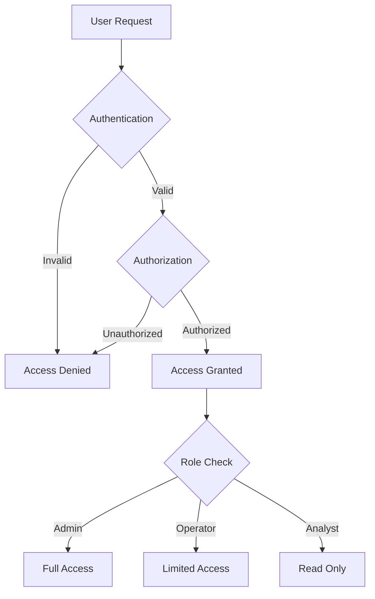

## 7.2 Data Security

### Encryption Standards

| Layer | Method | Key Length |
|-------|---------|------------|
| Data at Rest | AES-256-GCM | 256-bit |
| Data in Transit | TLS 1.3 | 256-bit |
| API Tokens | JWT/HMAC | 512-bit |
| Database | Transparent Data Encryption | 256-bit |

### Sensitive Data Handling

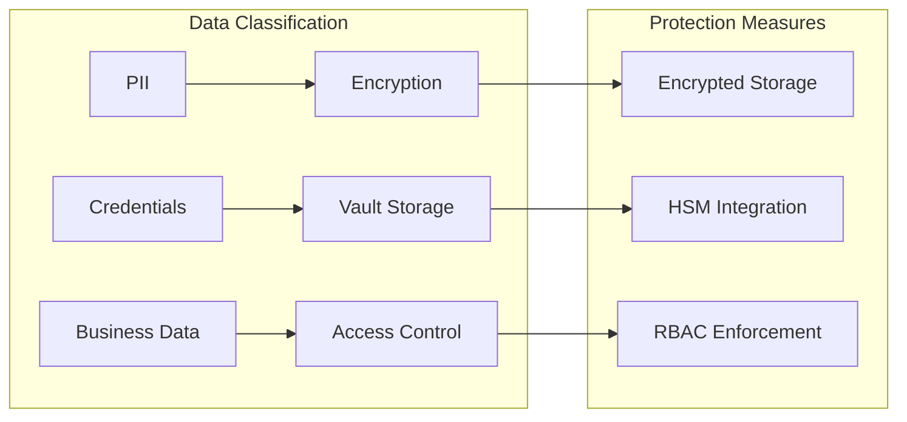

## 7.3 Security Protocols

### Network Security

| Layer | Protection Measure | Implementation |
|-------|-------------------|----------------|
| Edge | WAF | Cloudflare Enterprise |
| Network | IDS/IPS | Suricata |
| Container | Network Policies | Kubernetes Network Policies |
| Application | Rate Limiting | Redis-based token bucket |

### Security Monitoring

```mermaid
flowchart TD
    subgraph Detection
        A[Log Collection] --> B[SIEM]
        C[Metrics] --> B
        D[Alerts] --> B
    end
    
    subgraph Response
        B --> E{Severity Check}
        E -->|High| F[Immediate Action]
        E -->|Medium| G[Investigation]
        E -->|Low| H[Logging]
    end
```

### Compliance Controls

| Requirement | Implementation | Verification |
|------------|----------------|--------------|
| Access Logging | ELK Stack | Daily Audit |
| Data Privacy | Field-level Encryption | Quarterly Review |
| Secure Config | HashiCorp Vault | Version Control |
| Vulnerability Management | Snyk + Trivy | Weekly Scans |

### Security Update Process

```mermaid
flowchart LR
    subgraph Update Management
        A[Security Advisory] --> B{Risk Assessment}
        B -->|Critical| C[Emergency Patch]
        B -->|High| D[Next Sprint]
        B -->|Medium| E[Scheduled Update]
        B -->|Low| F[Backlog]
    end
    
    subgraph Deployment
        C --> G[Test]
        D --> G
        E --> G
        G --> H[Deploy]
        H --> I[Verify]
    end
```

# 8. INFRASTRUCTURE

## 8.1 DEPLOYMENT ENVIRONMENT

| Environment Type | Purpose | Configuration |
|-----------------|---------|---------------|
| Development | Local development and testing | - Docker Desktop<br>- Minikube<br>- Local databases |
| Staging | Pre-production validation | - Cloud-based<br>- Scaled-down replica<br>- Test data |
| Production | Live system operation | - Multi-region cloud<br>- High availability<br>- Full redundancy |
| DR | Disaster recovery | - Cross-region standby<br>- Hot backup<br>- Automated failover |

```mermaid
flowchart TD
    subgraph Production
        A[Primary Region] --> B[Load Balancer]
        B --> C[Application Cluster]
        C --> D[Database Cluster]
        D --> E[Backup System]
    end
    
    subgraph DR
        F[Standby Region] --> G[Load Balancer]
        G --> H[Application Cluster]
        H --> I[Database Cluster]
    end
    
    E --> I
    D <--> I
```

## 8.2 CLOUD SERVICES

| Service Category | AWS Service | Purpose | Configuration |
|-----------------|-------------|---------|---------------|
| Compute | EKS | Container orchestration | Multi-AZ, Auto-scaling |
| Database | RDS PostgreSQL | Primary data store | Multi-AZ, Read replicas |
| NoSQL | DocumentDB | Scraped data storage | Sharded cluster |
| Cache | ElastiCache | In-memory caching | Redis cluster mode |
| Storage | S3 | Object storage | Cross-region replication |
| CDN | CloudFront | Static content delivery | Global edge locations |
| Security | KMS | Key management | Automatic rotation |
| Monitoring | CloudWatch | System monitoring | Custom metrics |

## 8.3 CONTAINERIZATION

```mermaid
graph TD
    subgraph Base Images
        A[Python 3.11-slim] --> B[Backend Services]
        C[Node 18-alpine] --> D[Frontend Services]
        E[Redis Alpine] --> F[Cache Services]
    end
    
    subgraph Service Containers
        B --> G[Scraping Engine]
        B --> H[Data Processor]
        D --> I[Web UI]
        D --> J[API Gateway]
        F --> K[Rate Limiter]
    end
```

### Container Specifications

| Service | Base Image | Resource Limits |
|---------|------------|-----------------|
| Scraping Engine | python:3.11-slim | CPU: 2, Memory: 2Gi |
| Data Processor | python:3.11-slim | CPU: 2, Memory: 4Gi |
| Web UI | node:18-alpine | CPU: 1, Memory: 1Gi |
| API Gateway | node:18-alpine | CPU: 1, Memory: 2Gi |
| Rate Limiter | redis:alpine | CPU: 1, Memory: 2Gi |

## 8.4 ORCHESTRATION

```mermaid
flowchart LR
    subgraph Kubernetes Cluster
        A[Ingress Controller] --> B[Service Mesh]
        B --> C[Application Pods]
        C --> D[Persistent Storage]
        
        E[Monitoring] --> C
        F[Auto-scaling] --> C
        G[Config Management] --> C
    end
```

### Kubernetes Configuration

| Component | Implementation | Purpose |
|-----------|---------------|----------|
| Service Mesh | Istio | Traffic management, security |
| Ingress | NGINX Ingress | Load balancing, routing |
| Config Management | ConfigMaps, Secrets | Application configuration |
| Auto-scaling | HPA, VPA | Resource optimization |
| Storage | CSI Drivers | Persistent data storage |
| Monitoring | Prometheus, Grafana | Performance monitoring |

## 8.5 CI/CD PIPELINE

```mermaid
flowchart LR
    subgraph CI Pipeline
        A[Source Code] --> B[Build]
        B --> C[Unit Tests]
        C --> D[Integration Tests]
        D --> E[Security Scan]
        E --> F[Container Build]
    end
    
    subgraph CD Pipeline
        F --> G[Dev Deploy]
        G --> H[Stage Deploy]
        H --> I[Production Deploy]
    end
    
    subgraph Validation
        J[Quality Gates] --> G
        J --> H
        J --> I
    end
```

### Pipeline Specifications

| Stage | Tools | Actions |
|-------|-------|---------|
| Code Quality | SonarQube | Static analysis, code coverage |
| Testing | Pytest, Jest | Unit/integration testing |
| Security | Snyk, Trivy | Vulnerability scanning |
| Build | Docker, BuildKit | Multi-stage builds |
| Deploy | ArgoCD | GitOps deployment |
| Monitoring | Datadog | Performance monitoring |

### Deployment Strategy

| Environment | Strategy | Rollback Time |
|------------|----------|---------------|
| Development | Direct deployment | Immediate |
| Staging | Blue/Green | < 5 minutes |
| Production | Canary | < 15 minutes |
| DR | Active-passive | < 30 minutes |

# APPENDICES

## A.1 GLOSSARY

| Term | Definition |
|------|------------|
| Active-Passive Failover | High availability configuration where standby system takes over when primary system fails |
| Canary Deployment | Release strategy where changes are gradually rolled out to a subset of users |
| Data Lineage | Tracking of data's lifecycle including origins, transformations, and movement |
| GitOps | Infrastructure and application management using Git as single source of truth |
| Hot Backup | Backup performed while system remains operational |
| Point-in-time Recovery | Capability to restore system to specific moment in time |
| Rate Limiting | Control mechanism to regulate request frequency |
| Schema Migration | Process of managing incremental database schema changes |
| Service Mesh | Infrastructure layer handling service-to-service communication |
| Transparent Data Encryption | Automated encryption of database files at storage level |

## A.2 ACRONYMS

| Acronym | Full Form |
|---------|-----------|
| ACID | Atomicity, Consistency, Isolation, Durability |
| API | Application Programming Interface |
| CDN | Content Delivery Network |
| CSI | Container Storage Interface |
| DR | Disaster Recovery |
| EKS | Elastic Kubernetes Service |
| HPA | Horizontal Pod Autoscaler |
| HSM | Hardware Security Module |
| IaC | Infrastructure as Code |
| OIDC | OpenID Connect |
| RBAC | Role-Based Access Control |
| SLA | Service Level Agreement |
| VPA | Vertical Pod Autoscaler |
| WAF | Web Application Firewall |

## A.3 TECHNICAL DEPENDENCIES

```mermaid
flowchart TD
    subgraph Infrastructure Dependencies
        A[Kubernetes 1.27+] --> B[Container Runtime]
        C[Istio 1.18+] --> D[Service Mesh]
        E[ArgoCD 2.8+] --> F[GitOps Deployment]
    end
    
    subgraph Database Dependencies
        G[PostgreSQL 15+] --> H[TimescaleDB]
        I[MongoDB 6.0+] --> J[Document Store]
        K[Redis 7.0+] --> L[Cache Layer]
    end
    
    subgraph Monitoring Dependencies
        M[Prometheus] --> N[Metrics Collection]
        O[Grafana] --> P[Visualization]
        Q[Jaeger] --> R[Distributed Tracing]
    end
```

## A.4 VERSION COMPATIBILITY MATRIX

| Component | Minimum Version | Maximum Version | Notes |
|-----------|----------------|-----------------|-------|
| Python | 3.11.0 | 3.11.x | Core runtime |
| Node.js | 18.0.0 | 18.x.x | API Gateway |
| PostgreSQL | 15.0 | 15.x | Primary database |
| MongoDB | 6.0.0 | 6.x | Document store |
| Redis | 7.0.0 | 7.x | Caching layer |
| Kubernetes | 1.27.0 | 1.28.x | Orchestration |
| Docker | 24.0.0 | 24.x | Containerization |

## A.5 PERFORMANCE BENCHMARKS

| Operation | Target Metric | Load Condition |
|-----------|--------------|----------------|
| API Response Time | < 200ms | 95th percentile |
| Data Processing | 1000 pages/minute | Normal load |
| Database Queries | < 100ms | 90th percentile |
| Cache Hit Rate | > 85% | Peak load |
| Task Scheduling | < 500ms | Queue depth 100 |
| Data Export | < 30s | 1GB dataset |

## A.6 COMPLIANCE CHECKLIST

```mermaid
flowchart LR
    subgraph Data Privacy
        A[GDPR] --> B[Data Protection]
        C[CCPA] --> B
        D[HIPAA] --> B
    end
    
    subgraph Security Standards
        E[ISO 27001] --> F[Security Controls]
        G[SOC 2] --> F
        H[PCI DSS] --> F
    end
    
    subgraph Web Standards
        I[robots.txt] --> J[Compliance]
        K[Rate Limits] --> J
        L[Terms of Service] --> J
    end
```

## A.7 ERROR CODES AND HANDLING

| Error Code | Description | Recovery Action |
|------------|-------------|----------------|
| E1001 | Rate limit exceeded | Implement exponential backoff |
| E1002 | Proxy failure | Rotate to next proxy |
| E1003 | Parser error | Retry with alternate selector |
| E1004 | Authentication failure | Refresh credentials |
| E1005 | Network timeout | Retry with increased timeout |
| E1006 | Data validation error | Log and skip record |
| E1007 | Storage failure | Failover to backup system |