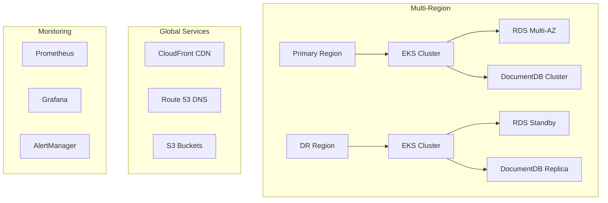

# Web Scraping Platform Infrastructure Documentation

## Table of Contents
- [Infrastructure Overview](#infrastructure-overview)
- [Prerequisites](#prerequisites)
- [AWS Infrastructure](#aws-infrastructure)
- [Kubernetes Setup](#kubernetes-setup)
- [Monitoring Stack](#monitoring-stack)
- [Deployment Guide](#deployment-guide)
- [Security](#security)
- [Maintenance](#maintenance)

## Infrastructure Overview

The Web Scraping Platform utilizes a robust, enterprise-grade infrastructure designed for high availability, scalability, and reliability.

### Architecture Overview


### Key Components
- Multi-region deployment for high availability
- Kubernetes-based microservices architecture
- Automated scaling and failover capabilities
- Comprehensive monitoring and alerting
- Disaster recovery with cross-region replication

## Prerequisites

### Required Tools
| Tool | Version | Purpose |
|------|---------|---------|
| AWS CLI | 2.13.0+ | AWS infrastructure management |
| kubectl | 1.27.0+ | Kubernetes cluster management |
| Terraform | 1.5.0+ | Infrastructure as Code |
| Helm | 3.12.0+ | Kubernetes package management |
| Docker | 24.0.0+ | Container management |

### Access Requirements
```bash
# AWS Credentials Setup
aws configure set aws_access_key_id <ACCESS_KEY>
aws configure set aws_secret_access_key <SECRET_KEY>
aws configure set region <PRIMARY_REGION>

# Kubernetes Context Setup
aws eks update-kubeconfig --name scraping-platform-cluster --region <REGION>
```

## AWS Infrastructure

### VPC Configuration
```hcl
# Reference: ./terraform/aws/main.tf
module "vpc" {
  source = "terraform-aws-modules/vpc/aws"
  version = "5.0.0"
  
  name = "scraping-platform-vpc"
  cidr = "10.0.0.0/16"
  
  azs             = ["us-east-1a", "us-east-1b", "us-east-1c"]
  private_subnets = ["10.0.1.0/24", "10.0.2.0/24", "10.0.3.0/24"]
  public_subnets  = ["10.0.101.0/24", "10.0.102.0/24", "10.0.103.0/24"]
}
```

### EKS Cluster Setup
```yaml
# Reference: ./kubernetes/apps/deployment.yaml
apiVersion: eksctl.io/v1alpha5
kind: ClusterConfig

metadata:
  name: scraping-platform-cluster
  region: us-east-1

nodeGroups:
  - name: ng-1
    instanceType: m5.large
    desiredCapacity: 3
    minSize: 2
    maxSize: 5
```

## Kubernetes Setup

### Namespace Organization
```bash
# Create required namespaces
kubectl create namespace scraping-platform
kubectl create namespace monitoring
kubectl create namespace ingress-nginx
```

### Resource Quotas
```yaml
apiVersion: v1
kind: ResourceQuota
metadata:
  name: compute-resources
  namespace: scraping-platform
spec:
  hard:
    requests.cpu: "20"
    requests.memory: 40Gi
    limits.cpu: "40"
    limits.memory: 80Gi
```

## Monitoring Stack

### Prometheus Setup
```yaml
# Reference: ./kubernetes/monitoring/prometheus-values.yaml
prometheus:
  prometheusSpec:
    retention: 15d
    resources:
      requests:
        memory: 4Gi
        cpu: 1000m
      limits:
        memory: 8Gi
        cpu: 2000m
```

### Grafana Dashboards
```yaml
# Reference: ./kubernetes/monitoring/grafana-values.yaml
grafana:
  dashboards:
    default:
      scraping-overview:
        file: dashboards/scraping-overview.json
      system-metrics:
        file: dashboards/system-metrics.json
```

## Deployment Guide

### Infrastructure Provisioning
```bash
# Initialize and apply Terraform configuration
cd terraform/aws
terraform init
terraform plan
terraform apply

# Verify EKS cluster access
kubectl get nodes
```

### Application Deployment
```bash
# Deploy application components
kubectl apply -f kubernetes/apps/
kubectl apply -f kubernetes/monitoring/

# Verify deployments
kubectl get pods -n scraping-platform
kubectl get services -n scraping-platform
```

## Security

### Access Management
- RBAC configuration for Kubernetes access
- IAM roles for AWS service access
- Secret management using AWS Secrets Manager
- Network policies for pod-to-pod communication

### Security Monitoring
```yaml
# Reference: ./kubernetes/monitoring/alertmanager-values.yaml
alertmanager:
  config:
    route:
      receiver: 'security-team'
      routes:
        - match:
            severity: critical
          receiver: 'security-team'
```

## Maintenance

### Backup Procedures
```bash
# Database backup
aws rds create-db-snapshot \
    --db-instance-identifier scraping-platform-db \
    --db-snapshot-identifier backup-$(date +%Y%m%d)

# EKS cluster backup
velero backup create backup-$(date +%Y%m%d)
```

### Update Procedures
1. Review change requirements
2. Create maintenance window
3. Apply updates using blue-green deployment
4. Verify system health
5. Update documentation

### Troubleshooting Guide
| Issue | Check | Resolution |
|-------|-------|------------|
| Pod Crash | `kubectl logs <pod>` | Check logs, restart pod |
| High CPU | Grafana metrics | Scale resources |
| Network Issues | Security groups | Verify VPC config |

## Version History

| Version | Date | Changes |
|---------|------|---------|
| 1.0.0 | 2024-01-20 | Initial documentation |

## Contact

- Infrastructure Team: infrastructure@platform.com
- Security Team: security@platform.com
- Platform Architects: architects@platform.com