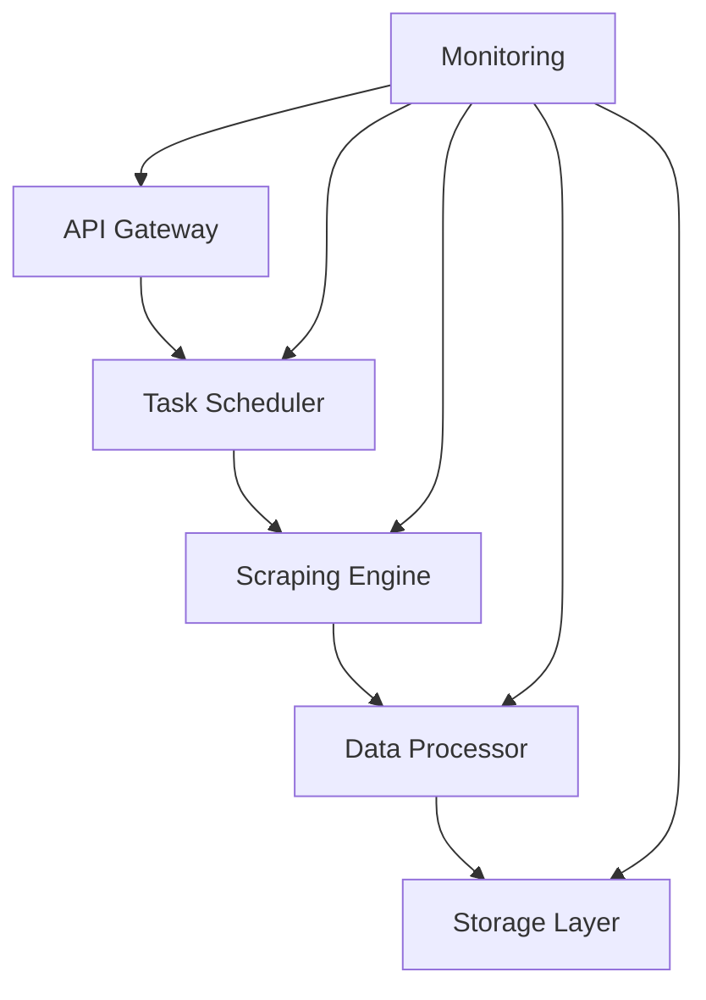
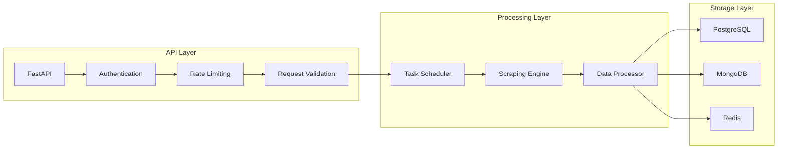

# Web Scraping Platform - Backend Service

Enterprise-grade web scraping platform backend service providing scalable, reliable, and secure data collection capabilities.

## Overview

### System Architecture


### Key Features
- Concurrent web scraping with 100+ simultaneous tasks
- Intelligent proxy rotation and request rate limiting
- Robust data validation and transformation pipeline
- Comprehensive security with OAuth 2.0 + JWT authentication
- Extensive monitoring and alerting capabilities
- RESTful API with OpenAPI documentation

### Technology Stack
- Python 3.11+ (Core runtime)
- FastAPI (API framework)
- SQLAlchemy 2.0+ (ORM)
- Playwright 1.38+ (Web automation)
- PostgreSQL 15+ (Primary database)
- MongoDB 6.0+ (Scraped data storage)
- Redis 7.0+ (Caching and rate limiting)

### Performance Benchmarks
- API Response Time: < 200ms (95th percentile)
- Data Processing: 1000 pages/minute
- Concurrent Tasks: 100+
- Cache Hit Rate: > 85%
- Data Accuracy: 99.9%

### Security Overview
- OAuth 2.0 + OIDC authentication
- Role-based access control (RBAC)
- AES-256-GCM encryption at rest
- TLS 1.3 for data in transit
- Comprehensive audit logging

## Prerequisites

- Python 3.11+
- Docker 24.0+ and Docker Compose
- Poetry 1.5+ package manager
- Make (optional)
- Git 2.40+
- Node.js 18+ (for API documentation)

## Getting Started

### Environment Setup
```bash
# Clone repository
git clone <repository-url>
cd backend

# Install dependencies
poetry install

# Configure environment
cp .env.example .env

# Start development services
docker-compose up -d

# Initialize database
poetry run alembic upgrade head

# Run tests
poetry run pytest
```

### Configuration Management
1. Copy `.env.example` to `.env`
2. Configure required environment variables:
   - Database credentials
   - API keys and secrets
   - Service endpoints
   - Feature flags
   - Logging configuration

### Local Development
```bash
# Install pre-commit hooks
poetry run pre-commit install

# Run code quality tools
poetry run black src tests
poetry run isort src tests
poetry run mypy src

# Run tests with coverage
poetry run pytest --cov=src
```

## Development

### Code Style and Standards
- Black code formatter
- isort for import sorting
- mypy for static type checking
- flake8 for linting
- pytest for testing
- pre-commit hooks for automated checks

### Testing Strategy
- Unit tests: pytest
- Integration tests: pytest-asyncio
- API tests: pytest-asyncio + httpx
- Performance tests: locust
- Coverage threshold: 90%

### Database Operations
```bash
# Create new migration
poetry run alembic revision --autogenerate -m 'description'

# Apply migrations
poetry run alembic upgrade head

# Seed initial data
poetry run python -m scripts.seed_data
```

### API Documentation
- OpenAPI 3.0 specification
- Interactive documentation at `/docs`
- Authentication examples
- Request/response schemas
- Error codes and handling
- Rate limiting documentation

### Error Handling
- Structured error responses
- Detailed error logging
- Retry mechanisms
- Circuit breakers
- Fallback strategies

### Logging
- Structured JSON logging
- Log levels: DEBUG, INFO, WARNING, ERROR, CRITICAL
- Request/response logging
- Performance metrics
- Security events

## Architecture

### Component Overview


### Security Architecture
- OAuth 2.0 + JWT authentication
- Role-based access control
- API key management
- Rate limiting
- Request validation
- Data encryption
- Audit logging

### Scaling Strategy
- Horizontal scaling of API nodes
- Database sharding
- Redis cluster
- Load balancing
- CDN integration
- Cache optimization

## Deployment

### Production Setup
```bash
# Build production image
docker build -t scraping-platform-backend .

# Deploy with docker-compose
docker-compose -f docker-compose.prod.yml up -d

# Deploy to Kubernetes
kubectl apply -f k8s/
```

### Environment Configuration
- Production-ready settings
- Security hardening
- Performance optimization
- Monitoring setup
- Backup configuration
- SSL/TLS setup

### Monitoring Setup
- Prometheus metrics
- Grafana dashboards
- ELK stack for logging
- Alerting configuration
- Performance monitoring
- Security monitoring

## Contributing

### Development Workflow
1. Fork repository
2. Create feature branch
3. Implement changes
4. Add tests
5. Update documentation
6. Submit pull request

### Code Review Process
- Automated checks
- Manual review
- Security review
- Performance review
- Documentation review
- Testing verification

### Documentation Standards
- Clear and concise
- Code examples
- Architecture diagrams
- API documentation
- Deployment guides
- Troubleshooting guides

## License

Copyright © 2024. All rights reserved.