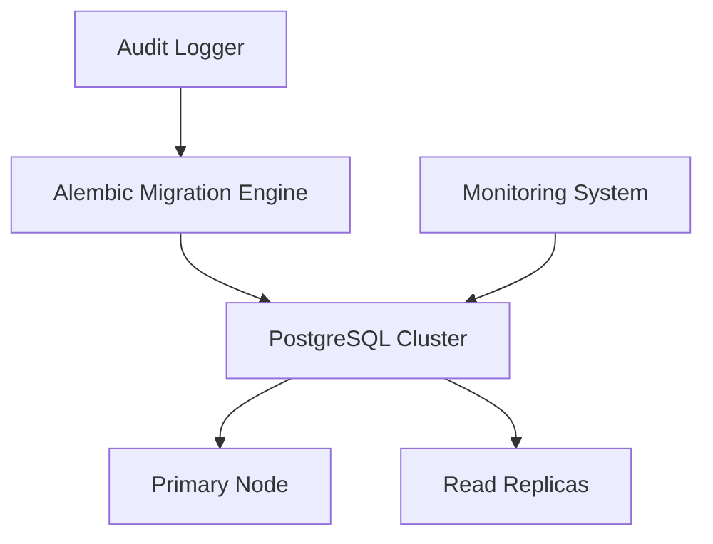

# Database Migrations Guide
Version: 1.0.0
Last Updated: 2024-01-20

## Table of Contents
- [Overview](#overview)
- [Architecture](#architecture)
- [Migration Management](#migration-management)
- [Security](#security)
- [High Availability](#high-availability)
- [Troubleshooting](#troubleshooting)
- [Maintenance](#maintenance)

## Overview

This document provides comprehensive guidance for managing database schema migrations in the Web Scraping Platform using Alembic with PostgreSQL 15+. The migration system is designed for enterprise-grade reliability, security, and high availability.

### Key Features
- Automated schema version control
- Zero-downtime migration capability
- Integrated monitoring and alerting
- Compliance-ready audit logging
- Automated rollback procedures

## Architecture

### Integration Points


### Components
- **Migration Engine**: Alembic 1.12+ with custom extensions
- **Database**: PostgreSQL 15+ in high-availability configuration
- **Monitoring**: Prometheus/Grafana integration
- **Logging**: ELK Stack for audit trails

## Migration Management

### Common Commands

#### Generate New Migration
```bash
# Auto-generate migration from model changes
alembic revision --autogenerate -m "description"

# Generate empty migration
alembic revision -m "description"

# Generate SQL-only migration
alembic revision --sql -m "description"
```

#### Apply Migrations
```bash
# Apply all pending migrations
alembic upgrade head

# Apply next migration only
alembic upgrade +1

# Generate SQL without applying
alembic upgrade head --sql
```

#### Rollback Operations
```bash
# Rollback last migration
alembic downgrade -1

# Rollback to specific version
alembic downgrade <revision_id>

# Generate rollback SQL
alembic downgrade -1 --sql
```

### Best Practices

1. **Migration Naming**
   - Use descriptive, action-based names
   - Include ticket/issue reference
   - Example: `20240120_add_user_table_TICKET-123`

2. **Data Safety**
   - Always include downgrade procedures
   - Test migrations on copy of production data
   - Verify data integrity post-migration

3. **Performance**
   - Use batching for large data migrations
   - Monitor replication lag
   - Schedule during low-traffic periods

## Security

### Access Control
- Migrations require elevated database privileges
- Audit logging of all schema changes
- Role-based access control for migration execution

### Sensitive Data Handling
```sql
-- Example of handling sensitive data during migration
-- Use encryption for sensitive columns
ALTER TABLE users
ADD COLUMN encrypted_data bytea,
ADD COLUMN encryption_key_id uuid;
```

### Compliance Requirements
- GDPR data protection measures
- SOC 2 audit trail maintenance
- PCI DSS compliance for relevant data

## High Availability

### Zero-Downtime Migration Strategy
1. Deploy application supporting both schemas
2. Apply migrations with replication
3. Verify replication completion
4. Switch application to new schema
5. Clean up old schema support

### Monitoring Thresholds
| Metric | Warning | Critical |
|--------|---------|----------|
| Replication Lag | > 10s | > 30s |
| Migration Duration | > 5min | > 15min |
| Table Lock Time | > 1s | > 5s |

## Troubleshooting

### Error Codes

| Code | Description | Resolution |
|------|-------------|------------|
| MIG001 | Migration conflict | Manual merge required |
| MIG002 | Replication lag | Pause and wait for sync |
| MIG003 | Lock timeout | Retry during low traffic |
| MIG004 | Version mismatch | Verify migration history |

### Common Issues
1. **Locked Tables**
   ```sql
   -- Check for locks
   SELECT * FROM pg_locks WHERE NOT granted;
   ```

2. **Replication Issues**
   ```sql
   -- Check replication status
   SELECT * FROM pg_stat_replication;
   ```

## Maintenance

### Regular Tasks
- Weekly validation of migration procedures
- Monthly review of migration documentation
- Quarterly cleanup of migration history
- Semi-annual disaster recovery testing

### Documentation Updates
- Record new edge cases
- Update command examples
- Validate all procedures
- Incorporate incident learnings

### Validation Checklist
- [ ] Test migrations in staging
- [ ] Verify rollback procedures
- [ ] Validate monitoring integration
- [ ] Check compliance requirements
- [ ] Update documentation

## References

- [Alembic Documentation](https://alembic.sqlalchemy.org/)
- [PostgreSQL Documentation](https://www.postgresql.org/docs/15/index.html)
- Internal References:
  - `env.py`: Migration environment configuration
  - `script.py.mako`: Migration script template

## Support

For migration-related issues:
1. Check troubleshooting section
2. Review logs in ELK Stack
3. Contact Database Team (#db-team on Slack)
4. Escalate to On-Call DBA if urgent

---
*This documentation is maintained by the Database Infrastructure Team*